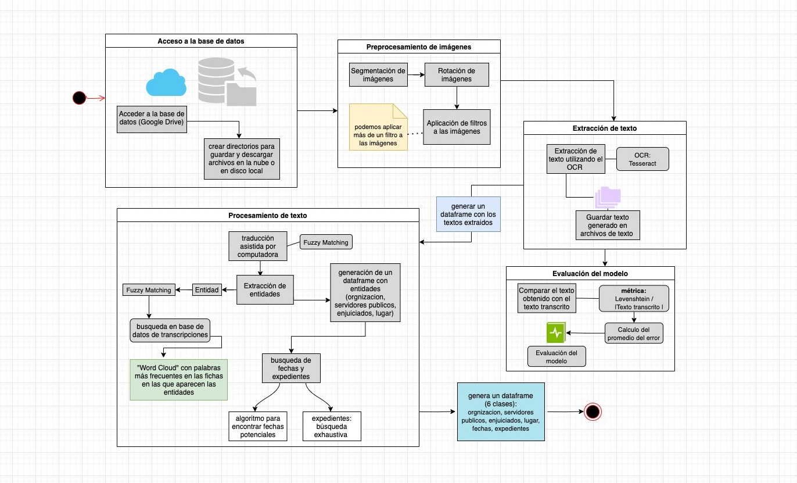

# Hackathon-RIIAA-2021 "JusticIA para los desaparecidos"

# Extracción de texto

## **Nombre del equipo:** Gato Encerrado

## **Integrantes**

Rebeca Angulo Rojas [Rebeca98](https://github.com/Rebeca98)

Javier Carrillo Martínez [Javcm](https://github.com/Javcm)

Rolando Corona Jiménez [rolandocj](https://github.com/rolandocj)

María Andrea Liliana Gómez Herrera [andrea-liliana](https://github.com/andrea-liliana)

Tulio Pérez Ortega [tulio2](https://github.com/tulio2)

## Pipeline
1. Obtener los datos (imágenes)
2. Preprocesamiento de imágenes: segmentación, rotación y aplicación de filtros a la imagen
3. Extracción y almacenamiento del texto generado
4. Procesamiento de texto: extracción de entidades y almacenamiento de resultados

## Cómo correr el código
1. Instalación previa de paquetes necesarios para python `requierements.txt`
2. Ejecutar el ipynb `implementacion_preprocesamiento_extraccion.ipynb`. Dentro del notebook vienen las instrucciones para importar las respectivas librerías.  

## Entregables por reto
Las bases de datos correspondientes al reto 2A y 2B se encuentran en este repositorio como reto_2A_extraccion.csv y reto_2b_entidades_identificadas.csv.

## Notas
## Esta actualización corresponde a la implementación final.

